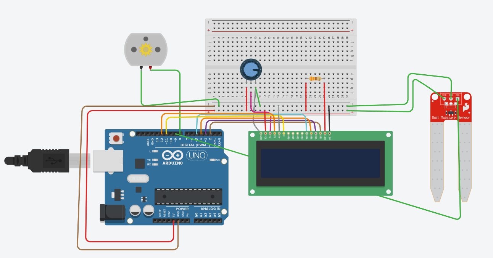

# SISTEMA DE RIEGO AUTOMÁTICO
## LÓGICA DE SISTEMAS - 12023-7590-005-B
Este proyecto esta orientado para un sistema de riego automático con sensores de humedad y temperatura.

## LISTA DE COMPONENTES ELECTRÓNICOS
* 1 Arduino uno
* 1 protoboard
* Cables
* 1 resistencia
* Pantalla LCD
* Potenciómetro 10K
* Mini bomba
* sensor de humedad  DHT11
* Manguera (que se acople con la mini bomba)

---
## Diagrama Arduino UNO
